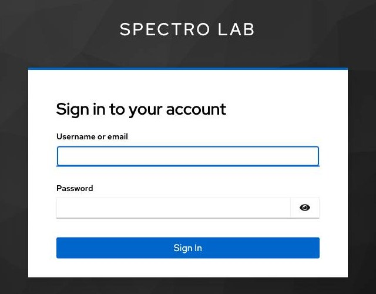

# 2. First sign-in

## Sign in with SSO

Open <https://factory.fedlab.xyz/>. Click **Sign in with SSO**.



- Username: the `party-guest-N` or `party-host-N` in your group's file
- Password: `Spectro123!!`

## Upload your public SSH key

Click your username (top right) → **SSH key**. Paste the entire contents of `~/.ssh/id_ed25519.pub` into the box. Save.

The public key looks like one line:

```
ssh-ed25519 AAAAC3Nz…rest…of…the…key you@yourlaptop
```

## What's next

Now open your assigned BMC page — the URL is in your group's file — in the same browser tab. The next section explains what you're looking at.
