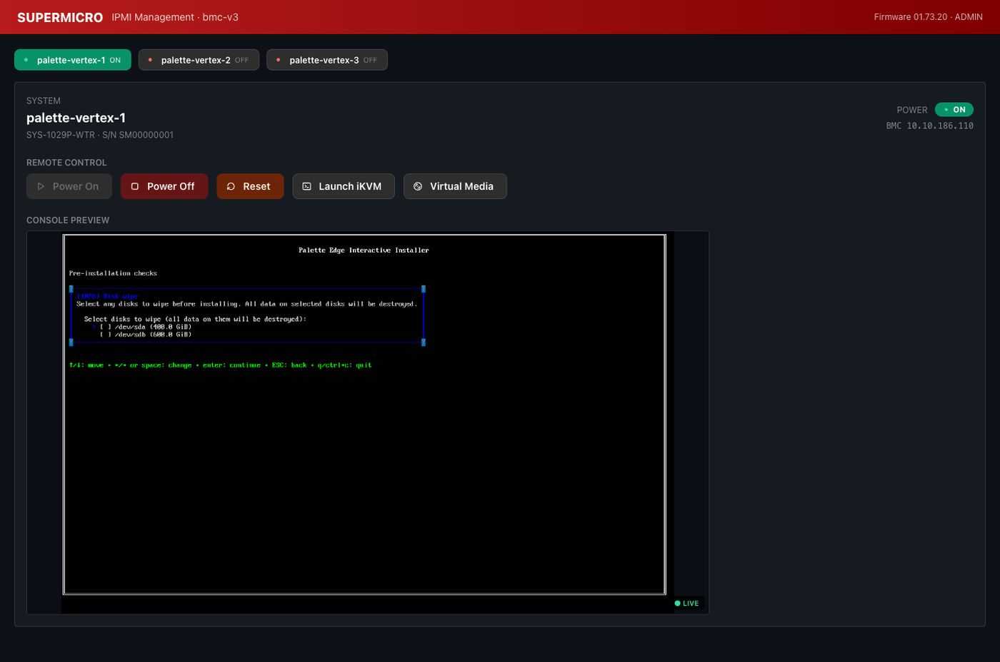

# 3. The BMC console

Each range's BMC console gives you a screen for each appliance node, lets you power a node on and off, and lets you attach an ISO — enough to walk through a product installer as if you were racked next to the hardware.

## What's on the screen

- A **node list**: one row per appliance VM in your range (`node-1`, `node-2`, …).
- For the selected node: a **console preview** (live if the node is on) and the usual controls (power on, power off, reset, mount media, boot order).

## Mount the ISO before you power on

The nodes ship with empty disks and no boot media. Before any node will do anything useful you need to attach the vendor ISO.

1. On your **range page** (drop `/bmc` from your BMC URL), upload the vendor ISO once. Once uploaded, every node in the range can attach it — you don't upload per node.
2. Back on the BMC console, pick a node. Under the media / virtual drives control, pick the uploaded ISO and **Insert**.
3. Set boot order so the CD / virtual drive is **first**. This is what makes the node boot the installer instead of the empty disk.
4. Power on.

After the install finishes and the node reboots, **Eject** the ISO and set the disk first, or the node boots the installer again.

## Network config during the install

The vendor installer's TUI will ask you for each node's hostname, static IP, subnet mask, gateway, DNS, and a cluster VIP. These are not free choices — the bastion's haproxy is pre-configured for specific values per range, and anything else will not route.

Your party file lists the exact values to type: node hostnames, node IPs, subnet mask, gateway, DNS, and VIP.

## What this page is not

Not a way to reach the operating system after install. Once the appliance is up, you'll ssh to it through the bastion — next section.
