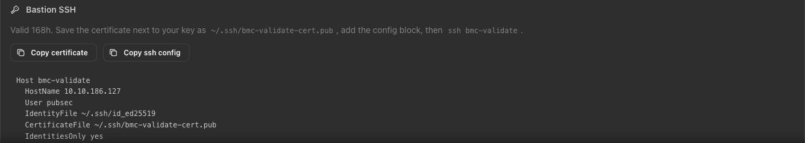

# 4. SSH to the bastion

The bastion is the only way into the range. Your laptop reaches the bastion. The bastion reaches every node on the range. Nodes refuse your laptop key directly — that is intentional, not a broken permission.

## Mint a certificate and set up the aliases

On the range page (drop `/bmc` from your BMC URL), click **Get certificate** under Bastion SSH. Your public key is already stored (from step 2), so there is nothing to paste.



The dialog gives you two things:

- A **certificate blob** — save it to `~/.ssh/<range-name>-cert.pub`.
- An **ssh config block** — append it to `~/.ssh/config`, then add three more `Host` blocks for the nodes (fill in your range name and IDX from your party file).

```
Host vertex-tue-am
  HostName 10.10.186.126
  User pubsec
  IdentityFile ~/.ssh/id_ed25519
  CertificateFile ~/.ssh/vertex-tue-am-cert.pub
  IdentitiesOnly yes

Host vertex-tue-am-n1 vertex-tue-am-n2 vertex-tue-am-n3
  User admin
  ProxyJump vertex-tue-am
Host vertex-tue-am-n1
  HostName 10.240.6.10
Host vertex-tue-am-n2
  HostName 10.240.6.11
Host vertex-tue-am-n3
  HostName 10.240.6.12
```

The first block (from the dialog) gets you the bastion. The three node blocks below it use ProxyJump so `ssh <range>-n1` from your laptop routes through the bastion transparently.

## Connect

```
ssh vertex-tue-am
```

Substitute your range name. On success you land in a shell as `pubsec` on the bastion:

```
Welcome to Ubuntu 22.04.4 LTS (GNU/Linux 5.15.0-100-generic x86_64)

Last login: Mon Sep 28 04:15:22 2026 from 10.7.8.9
pubsec@vertex-tue-am:~$
```

If it refuses your key: the certificate lives 168 hours. On the range page, **Get certificate** again — that mints a new one and is the fix for every "used to work" refusal.

## What lives on the bastion

- `~/range/secrets.env` — this range's credentials (product API keys, etc.)
- `rangectl` — the helper CLI. Try `rangectl summary` and `rangectl cluster status` for a picture of the range.
